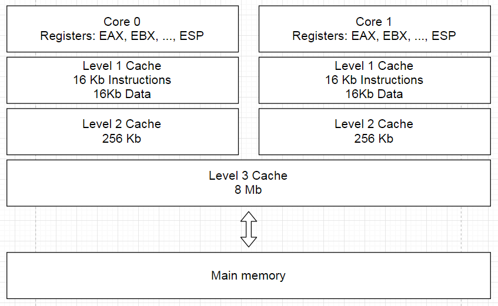
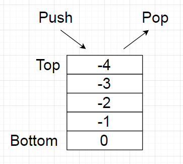

# Память в С++
### Кеш, оперативная память, стек и куча, выделение и освобождение памяти
##

#### Процессор


#### Важные константы
```
1 такт = 1 / частота процессора
1 / 3 GHz = 0.3 ns
                                             0.3 ns
L1 cache reference                           0.5 ns
Branch mispredict                            5   ns
L2 cache reference                           7   ns
Mutex lock/unlock                           25   ns
Main memory reference                      100   ns
Compress 1K bytes with Zippy             3,000   ns
Send 1K bytes over 1 Gbps network       10,000   ns
Read 4K randomly from SSD              150,000   ns
Read 1 MB sequentially from memory     250,000   ns
Round trip within same datacenter      500,000   ns
Read 1 MB sequentially from SSD      1,000,000   ns
HDD seek                            10,000,000   ns
Read 1 MB sequentially from HDD     20,000,000   ns
Send packet CA->Netherlands->CA    150,000,000   ns
```
Источник: [https://gist.github.com/jboner/2841832](https://gist.github.com/jboner/2841832)

#### Стек (Stack)


```
int i = 5;
std::string name;
char data[5];
```

#### Куча (Heap)
```
int* i = (int*) malloc(sizeof(int));
std::string* name = new std::string();
char* data = new char[5];
...
free(i);
delete(name);
delete[] data;
```

#### Data segment
```
static const int i = 5;
static std::string name;
extern char data[5];
```


